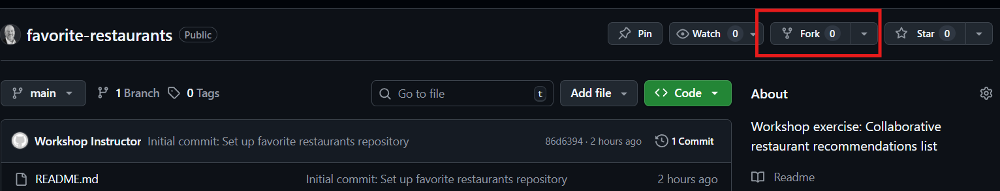
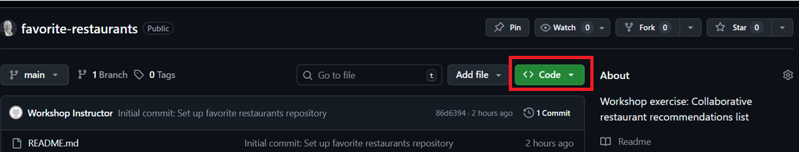
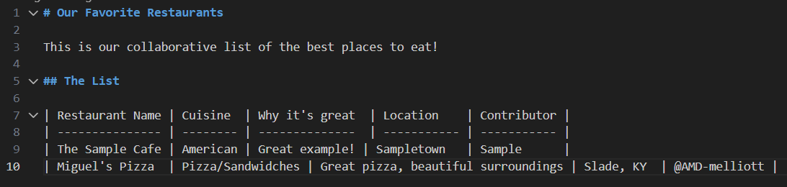
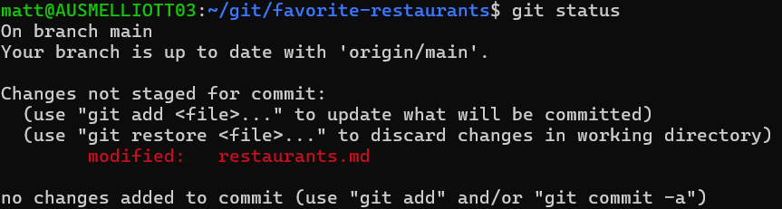
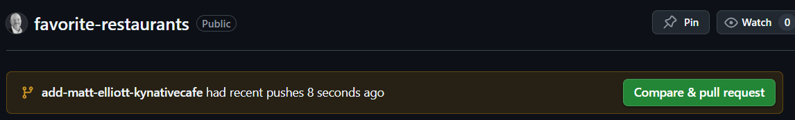
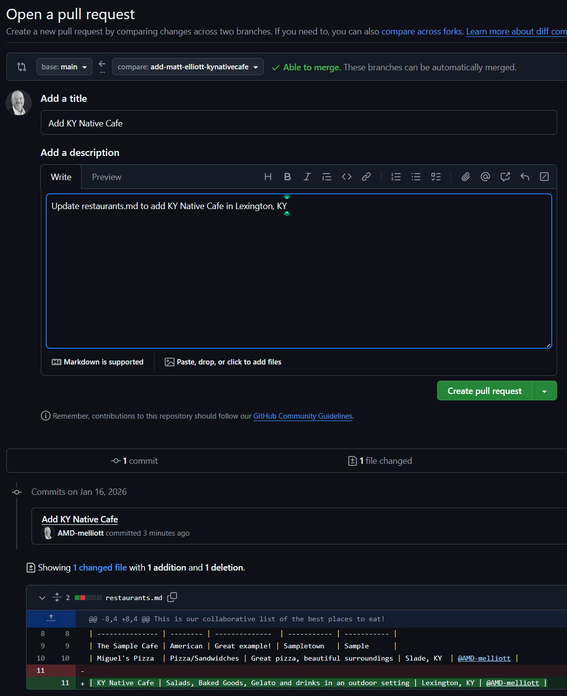

# Favorite Restaurants

Welcome to our collaborative restaurant recommendation list!

## Workshop Goal
Practice the Git/GitHub workflow by contributing your favorite restaurant to our shared list. This exercise will teach you the fundamental workflow used by development and documentation teams worldwide.

---

## Prerequisites

Before starting, make sure you have:
- A [GitHub account](https://github.com/signup) (it's free!)
- [Git installed](https://git-scm.com/downloads) on your computer
- A text editor (we recommend [VS Code](https://code.visualstudio.com/))
- Basic familiarity with your computer's terminal/command line

**New to Git?** Check out GitHub's [Git Handbook](https://guides.github.com/introduction/git-handbook/) for a quick introduction.

---

## Step-by-Step Instructions

### Step 1: Fork this Repository

A "fork" creates your own personal copy of this project on GitHub.

1. Make sure you're logged into your GitHub account
2. Navigate to this repository on GitHub
3. Click the **Fork** button in the top-right corner of the page



4. Select your personal account as the destination for the fork
5. Wait a few seconds while GitHub creates your copy

**What happened?** You now have your own copy at `https://github.com/YOUR-USERNAME/favorite-restaurants`

**Learn more:** [GitHub Docs: Fork a repo](https://docs.github.com/en/get-started/quickstart/fork-a-repo)

---

### Step 2: Clone Your Fork to Your Computer

"Cloning" downloads your forked repository to your local machine so you can edit files.

1. On **your fork's page** (not the original), click the green **Code** button



2. Make sure **HTTPS** is selected (it usually is by default)
3. Click the copy icon to copy the URL (it should look like `https://github.com/YOUR-USERNAME/favorite-restaurants.git`)
4. Open your terminal or command prompt
5. Navigate to where you want to store the project (e.g., `cd Documents`)
6. Run this command (replace the URL with the one you copied):

```bash
git clone https://github.com/YOUR-USERNAME/favorite-restaurants.git
```

7. Enter the project folder:

```bash
cd favorite-restaurants
```

**Learn more:** [GitHub Docs: Cloning a repository](https://docs.github.com/en/repositories/creating-and-managing-repositories/cloning-a-repository)

---

### Step 3: Create a New Branch

Branches allow you to work on changes without affecting the main version. Think of it as a "scratch space" for your edits.

1. In your terminal, make sure you're in the `favorite-restaurants` folder
2. Create a new branch with a descriptive name (use your name and the restaurant):

```bash
git checkout -b add-YOUR-NAME-restaurant
```

**Example:**

```bash
git checkout -b add-sarah-joes-pizza
```

3. You should see a message: `Switched to a new branch 'add-sarah-joes-pizza'`

**What's happening?** The `-b` flag creates a new branch and switches to it in one command.

**Learn more:** [GitHub Docs: About branches](https://docs.github.com/en/pull-requests/collaborating-with-pull-requests/proposing-changes-to-your-work-with-pull-requests/about-branches)

---

### Step 4: Add Your Restaurant Recommendation

Now it's time to make your contribution!

1. Open the `restaurants.md` file in your text editor
2. Scroll to the bottom of the table
3. Add a new row with your restaurant information following this format:

```markdown
| Restaurant Name | Cuisine | Why it's great | Contributor |
| --------------- | ------- | -------------- | ----------- |
| Joe's Pizza     | Italian | Best NY-style pizza! | @yourhandle |
```

**Tips:**

- Keep your entries concise
- Use your GitHub username for the Contributor field (with the @ symbol)
- Make sure the spacing with `|` characters aligns with the rows above

4. Save the file (Ctrl+S on Windows/Linux, Cmd+S on Mac)



---

### Step 5: Check What Changed

Before saving your work to Git, let's see what you modified.

```bash
git status
```

You should see `restaurants.md` listed in **red** under "Changes not staged for commit."



**What does this mean?** Git has detected your changes, but they're not "staged" (prepared) for saving yet.

**Learn more:** [Git Docs: git status](https://git-scm.com/docs/git-status)

---

### Step 6: Stage and Commit Your Changes

Now we'll "commit" your changes - think of this as creating a labeled snapshot of your work.

1. **Stage** your changes (prepare them for saving):

```bash
git add restaurants.md
```

Or stage all changed files at once:

```bash
git add .
```

2. **Commit** your changes with a clear message:

```bash
git commit -m "Add Joe's Pizza to restaurant list"
```

**Tip:** Use a descriptive commit message that explains what you changed and why.

3. Check that it worked:

```bash
git log -1
```

You should see your commit with your message!

**Learn more:**
- [Git Docs: git add](https://git-scm.com/docs/git-add)
- [Git Docs: git commit](https://git-scm.com/docs/git-commit)

---

### Step 7: Push Your Changes to GitHub

"Pushing" uploads your local commits to your GitHub fork.

```bash
git push origin add-YOUR-NAME-restaurant
```

**Example:**
```bash
git push origin add-sarah-joes-pizza
```

**What's `origin`?** It's the nickname Git uses for your GitHub repository.

**Learn more:** [GitHub Docs: Pushing commits](https://docs.github.com/en/get-started/using-git/pushing-commits-to-a-remote-repository)

---

### Step 8: Create a Pull Request

A "Pull Request" (PR) is how you propose your changes to be added to the original project.

1. Go to **your fork** on GitHub in your web browser
2. You should see a yellow banner saying **"add-YOUR-NAME-restaurant had recent pushes"** with a green **Compare & pull request** button



3. Click the **Compare & pull request** button
4. You'll see a page to create your PR:
   - **Title:** Give it a clear title (e.g., "Add Joe's Pizza to the list")
   - **Description:** Add a brief description of what you're contributing
5. Click the green **Create pull request** button



**Congratulations!** 🎉 You've just created your first pull request!

**Learn more:** [GitHub Docs: Creating a pull request](https://docs.github.com/en/pull-requests/collaborating-with-pull-requests/proposing-changes-to-your-work-with-pull-requests/creating-a-pull-request)

---

## What Happens Next?

After you create your pull request:
1. The project maintainer (your instructor) will review your contribution
2. They may leave comments or request changes
3. Once approved, they'll **merge** your PR, and your restaurant will appear in the main list!
4. You can see all open and merged pull requests on the [Pull Requests tab](../../pulls)

---

## Troubleshooting

### "I don't see the yellow banner after pushing"
- Refresh your GitHub page
- Or manually navigate to the "Pull requests" tab and click "New pull request"

### "Git asks for my username and password"
- GitHub now requires a [personal access token](https://docs.github.com/en/authentication/keeping-your-account-and-data-secure/creating-a-personal-access-token) instead of your password
- Or set up [SSH keys](https://docs.github.com/en/authentication/connecting-to-github-with-ssh) for easier authentication

### "I made a mistake in my commit"
- You can make additional changes, stage them, and create a new commit
- Just push again, and your pull request will automatically update

---

## Additional Resources

- [GitHub Skills: Introduction to GitHub](https://github.com/skills/introduction-to-github)
- [Git Cheat Sheet](https://education.github.com/git-cheat-sheet-education.pdf)
- [VS Code Git Integration](https://code.visualstudio.com/docs/sourcecontrol/overview)
- [GitHub Glossary](https://docs.github.com/en/get-started/quickstart/github-glossary)

---

## Questions?

If you get stuck, don't hesitate to:
- Ask your instructor
- Check the [GitHub Community](https://github.community/)
- Review the linked documentation throughout this guide

Happy contributing! 🍕🍔🍜
